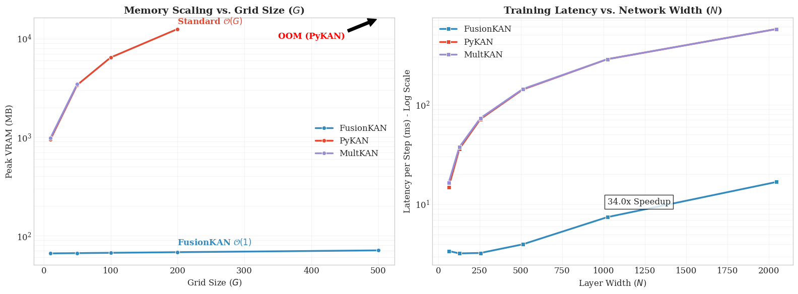

# FusionKAN: High-Performance CUDA Kolmogorov-Arnold Networks

**FusionKAN** is a highly optimized PyTorch library for Kolmogorov-Arnold Networks (KANs). By fusing B-spline basis computation, coefficient gathering, and linear combination into a single CUDA kernel, it achieves **33x speedups** and **Constant Memory Scaling** compared to standard implementations.



## 🚀 Key Highlights

### 1. Constant Memory Cost ($O(1)$)
Standard KAN implementations expand input tensors to size $[Batch, In, Grid]$, causing linear memory growth. FusionKAN computes basis functions on-the-fly in registers.
*   **Original KAN:** Crashes (OOM) at Grid=500 with >16GB VRAM usage.
*   **FusionKAN:** Stays constant at **~70 MB** VRAM regardless of grid size.

### 2. Massive Throughput (33x Speedup)
FusionKAN leverages the GPU's Read-Only Cache (`__ldg`) and minimizes memory round-trips.
*   **Latency:** Reduced from **570ms** to **17ms** per step (Width=2048, Batch=8192).
*   **Throughput:** Processes >475,000 samples/sec on a consumer GPU (T4).

### 3. Learnable Grids
Unlike standard implementations that require manual grid updates to handle data distribution shifts, FusionKAN treats grid boundaries (`min`, `max`) as learnable parameters. They are updated automatically via gradient descent, ensuring **smooth convergence** without loss spikes.

## 📊 Benchmark Results

Benchmarks run on NVIDIA T4, Float32, Batch Size 4096.

### Experiment 1 2D function

The benchmark is trying to learn a specific 2D function:

$$ f(x, y) = \exp(\sin(\pi x) + y^2) $$

| Model | Grid Size ($G$) | Peak VRAM | Time per Step |
| :--- | :--- | :--- | :--- |
| **PyKAN / MultKAN** | 200 | 12.5 GB | 565 ms |
| **FusionKAN** | 200 | **68 MB** | **3.2 ms** |
| | | | |
| **PyKAN / MultKAN** | 500 | **OOM (Crash)** | N/A |
| **FusionKAN** | 500 | **70 MB** | **3.2 ms** |

## 🛠️ Features

- **Fused CUDA Kernels:** Performs Grid Mapping + Basis computation + Gather + Multiply in a single kernel launch.
- **Scalable Backward Pass:** Uses direct Global Atomic accumulation to handle arbitrary layer widths (up to 2048+) without overflowing shared memory.
- **Physics Ready:** Supports exact input gradients ($\nabla x$) via analytical cubic spline derivatives, ideal for PINNs and Eikonal loss functions.
- **Drop-in Replacement:** Matches the `nn.Module` API for easy integration.

## 📦 Installation

**Prerequisites:**
- NVIDIA GPU
- CUDA Toolkit (nvcc)
- PyTorch

```bash
git clone https://github.com/yourusername/FusionKAN
cd FusionKAN
pip install .


💻 Usage
FusionKAN can be used just like a standard PyTorch linear layer, but with B-splines.

import torch
import torch.nn as nn
from fusion_kan import FusionKANLayer

# Define a model
model = nn.Sequential(
    # Layer 1: 2 Inputs -> 128 Hidden
    FusionKANLayer(2, 128, grid_size=100, spline_order=3),
    nn.LayerNorm(128),
    nn.SiLU(),
    
    # Layer 2: 128 Hidden -> 1 Output
    FusionKANLayer(128, 1, grid_size=100, spline_order=3)
).cuda()

# Dummy Data
x = torch.randn(8192, 2).cuda()

# Forward Pass
y = model(x)

# Backward Pass (Gradients propagate to weights AND grid bounds)
loss = y.sum()
loss.backward()

